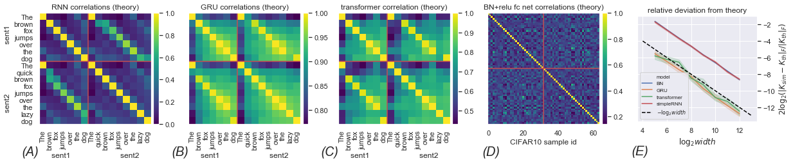

# Gaussian Process for Any Neural Architecture: Reference Implementations

*Update July 2020*

The 2nd paper in the Tensor Programs series, [*Neural Tangent Kernel for Any Architecture*](https://arxiv.org/abs/2006.14548), is now out! It shows that the *infinite-width limit* of a neural network of any architecture is well-defined (in the technical sense that the [tangent kernel (NTK)](https://arxiv.org/abs/1806.07572) of any randomly initialized neural network converges in the large width limit) and can be computed. The [associated repo](https://github.com/thegregyang/NTK4A) implements this infinite-width neural network for RNN, Transformer, and a Batchnorm+ReLU MLP.

--------------------------------------------

This repo is a companion to the paper

[**Tensor Programs I: Wide Feedforward or Recurrent Neural Networks of Any Architecture are Gaussian Processes**](https://arxiv.org/abs/1910.12478) 
*Greg Yang*

which shows that the Gaussian process behavior arises in wide, randomly initialized, neural networks regardless of architecture.

Despite what the title suggests, this repo does not implement the infinite-width GP kernel for every architecture, but rather demonstrates the derivation and implementation for a few select architectures.

Architecture        | Notebook                     | Colab
--------------------|------------------------------|-------
Simple RNN          | [Notebook](RNN.ipynb)        |  
GRU                 | [Notebook](GRU.ipynb)        | 
Transformer         | [Notebook](Transformer.ipynb)| 
Batchnorm+ReLU MLP  | [Notebook](Batchnorm.ipynb)  | 

[Plots.ipynb](Plots.ipynb) also reproduces Figure (3) of the paper.

We have included the GloVe embeddings `ExampleGloVeVecs.npy` of example sentences we feed into the networks, as well as their normalized Gram matrix `ExampleGloVeCov.npy`.
[GloVe.ipynb](GloVe.ipynb) recreates them; if you wish to try the  kernels on custom sentences, then modify [GloVe.ipynb](GloVe.ipynb) as appropriate.

